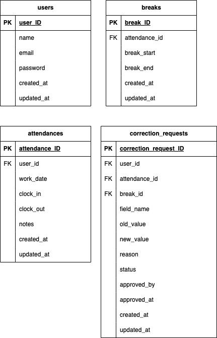

# 模擬案件2

## 環境構築

### Dockerビルド  
1. git clone git@github.com:Maki625/ laravel-test2.git  

2. docker-compose up -d build  

### Laravel環境構築  
1.docker-compose exec php bash  
2.composer install  
3.env.exampleファイルから.envを作成し、環境変数を変更  
4.php artisan key:generate  
5.php artisan migrate  
6.php artisan db:seed  

## 使用技術  
・Laravel 8  
・PHP 7  
・MySQL 8  

## ER図  
  

## URL  
・開発環境：http://localhost/  
・phpMyAdmin:http://localhost:8080/