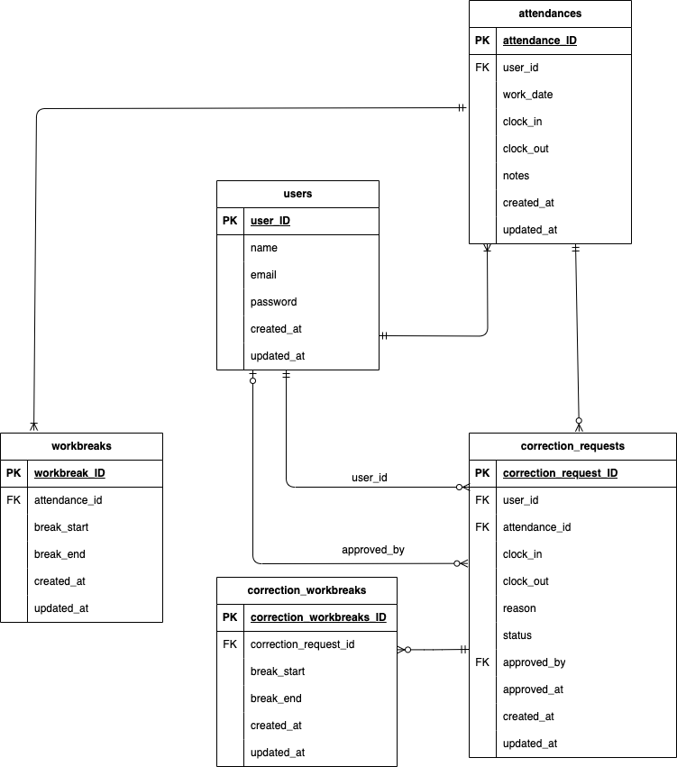

# 模擬案件2

## 環境構築

### Dockerビルド  
1. git clone git@github.com:Maki625/mogi2.git  

2. docker-compose up -d --build  

*MySQLは、OSによって起動しない場合があるのでそれぞれのPCに合わせて docker-compose.yml ファイルを編集してください。  

### Laravel環境構築  
1. docker-compose exec php bash  
2. composer install  
3. env.exampleファイルから.envを作成し、環境変数を変更  
4. php artisan key:generate  
5. php artisan migrate  
6. php artisan db:seed  

## 使用技術  
・Laravel 8  
・PHP 7  
・MySQL 8  

## 機能一覧  
・会員登録  
・ログイン／ログアウト  
・メール認証  
・勤務開始／終了  
・休憩開始／終了  
・勤怠一覧表示  
・勤怠レポート表示  
・勤怠詳細表示  
・勤怠修正申請  
・管理者による勤怠管理  

## ER図  
  

## URL  
・開発環境：http://localhost/  
・phpMyAdmin:http://localhost:8080/  
・MailHog：http://localhost:8025/  

## テスト用アカウント
・一般ユーザー1  
・メールアドレス：user1@example.com  
・パスワード：password  

・一般ユーザー2  
・メールアドレス：user2@example.com  
・パスワード：password  

・管理者  
・メールアドレス：user3@example.com  
・パスワード：password